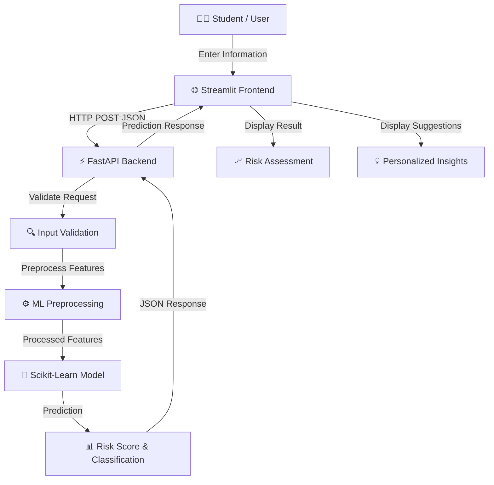

<div align="center">

# 🧠 Student Mental Health AI

### AI-Powered Student Mental-Health Risk Assessment

An AI-powered full-stack Machine Learning application that estimates student mental-health risk levels using academic, lifestyle, and social factors.


[🌐 Live Demo](https://student-mental-health-ai-checker.streamlit.app/) •
[⚡ API Docs](https://student-mental-health-ai.onrender.com/docs) •
[🐛 Report Bug](https://github.com/codeswith-pawan/student-mental-health-ai/issues)

</div>

---

## 📌 Overview

**Student Mental Health AI** is a full-stack Machine Learning application designed to provide an educational, model-based assessment of student mental-health risk.

The application collects relevant student information such as academic performance, lifestyle patterns, social factors, and other behavioral indicators. This information is processed through a Machine Learning pipeline, and the trained model generates a risk assessment.

The project demonstrates how a Machine Learning model can be integrated into a production-style application using a **Streamlit frontend** and a **FastAPI backend**.

The application provides:

* Mental-health risk prediction
* Risk score estimation
* Risk-level classification
* Personalized suggestions based on the predicted risk
* English and Hindi language support
* REST API integration
* Interactive web interface

> ⚠️ **Important Disclaimer:**
> This application is intended strictly for educational, awareness, and demonstration purposes. It does **not** provide medical or psychological diagnosis and should not be used as a substitute for professional mental-health advice, clinical assessment, or emergency services.

---

## 🚀 Live Application

### 🌐 Streamlit Frontend

👉 https://student-mental-health-ai-checker.streamlit.app/

The Streamlit application provides the interactive user interface where users can enter student-related information and receive the model's prediction.

### ⚡ FastAPI Backend

👉 https://student-mental-health-ai.onrender.com/

The FastAPI backend handles prediction requests and communicates with the trained Machine Learning model.

### 📚 Swagger API Documentation

👉 https://student-mental-health-ai.onrender.com/docs

Interactive API documentation is available through FastAPI's built-in Swagger UI.

---

## ✨ Features

### 🧠 Machine Learning Prediction

The application uses a trained **Scikit-Learn Machine Learning model** to estimate student mental-health risk.

The prediction pipeline processes the provided input features before passing them to the trained model.

---

### 📊 Risk Score & Risk Classification

The application provides a model-based assessment containing:

* Risk score
* Risk category
* Prediction result
* Supporting insights

The result is intended to help users understand potential risk patterns rather than provide a clinical diagnosis.

---

### 💡 Personalized Suggestions

Based on the predicted risk category, the application provides practical awareness-oriented suggestions.

These suggestions can help students think about areas such as:

* Study habits
* Sleep
* Physical activity
* Social interaction
* Screen/social-media usage
* Stress management
* Daily routine

---

### 🌐 Bilingual Interface

The application supports:

* 🇬🇧 English
* 🇮🇳 Hindi

Users can switch between languages through the application interface.

---

### ⚡ FastAPI REST API

The Machine Learning model is exposed through a FastAPI backend.

The backend:

1. Receives user input
2. Validates the request
3. Performs preprocessing/feature engineering
4. Sends the processed data to the trained model
5. Generates the prediction
6. Returns the result as JSON

---

### 🎨 Streamlit Interface

The frontend is built using Streamlit and provides:

* Interactive input forms
* Prediction results
* Risk visualization
* Suggestions
* Language switching
* Responsive user experience

---

### 🔐 Secure Backend Configuration

The Streamlit application communicates with the backend through configuration/secrets rather than exposing sensitive backend configuration directly in the source code.

---

## 🏗️ System Architecture



---

## 🔄 Prediction Workflow

The application follows the following workflow:

```text
User Input
    ↓
Streamlit Frontend
    ↓
HTTP POST Request
    ↓
FastAPI Backend
    ↓
Input Validation
    ↓
Feature Engineering / Preprocessing
    ↓
Trained ML Model
    ↓
Risk Prediction
    ↓
Risk Score / Classification
    ↓
FastAPI JSON Response
    ↓
Streamlit Result Dashboard
    ↓
Personalized Suggestions
```

---

## 🧩 Tech Stack

| Technology         | Purpose                                 |
| ------------------ | --------------------------------------- |
| 🐍 Python          | Core programming language               |
| 🎨 Streamlit       | Frontend / interactive web application  |
| ⚡ FastAPI          | REST API backend                        |
| 🧠 Scikit-Learn    | Machine Learning                        |
| 🐼 Pandas          | Data manipulation and preprocessing     |
| 🔢 NumPy           | Numerical computation                   |
| 📦 Joblib / Pickle | Model serialization                     |
| 🌐 HTTP / REST     | Frontend-backend communication          |
| ☁️ Streamlit Cloud | Frontend deployment                     |
| ☁️ Render          | Backend deployment                      |
| 🐙 GitHub          | Version control and source code hosting |

---

## 📁 Project Structure

```text
student-mental-health-ai/
│
├── app.py
│
├── backend/
│   ├── main.py
│   ├── model/
│   │   └── trained_model.pkl
│   │
│   ├── preprocessing/
│   │   └── ...
│   │
│   └── requirements.txt
│
├── data/
│   └── ...
│
├── notebooks/
│   └── ...
│
├── requirements.txt
├── README.md
├── .gitignore
└── ...
```

> **Note:** The exact file structure may vary depending on the current project implementation.

---

## 📥 Input Features

The model uses student-related information to generate a risk assessment.

Depending on the dataset/model configuration, the input can include factors related to:

### 🎓 Academic Factors

* Academic performance
* Study workload
* Academic pressure
* Attendance
* Examination-related stress

### 💤 Lifestyle Factors

* Sleep patterns
* Physical activity
* Daily routine
* Lifestyle habits

### 📱 Social & Digital Factors

* Social-media usage
* Screen-time patterns
* Social interaction
* Online activity

### 🧑‍🤝‍🧑 Personal / Social Factors

* Social support
* Relationships
* Environmental factors
* Other relevant behavioral indicators

---

## 🧠 Machine Learning Pipeline

The Machine Learning workflow consists of several stages.

### 1. Data Collection

A structured dataset containing student-related attributes is used for model development.

### 2. Data Preprocessing

The raw dataset is cleaned and transformed before model training.

Typical preprocessing operations include:

* Handling missing values
* Encoding categorical variables
* Numerical feature processing
* Feature transformation
* Input validation

### 3. Feature Engineering

Relevant input variables are transformed into the format required by the Machine Learning model.

### 4. Model Training

A Scikit-Learn model is trained using the prepared dataset.

### 5. Model Serialization

The trained model and required preprocessing components are saved so they can be loaded by the backend during inference.

### 6. Inference

When a user submits the form:

```text
User Input
     ↓
Preprocessing
     ↓
Trained Model
     ↓
Prediction
     ↓
Risk Assessment
```

---

## ⚙️ Backend API

The backend is implemented using **FastAPI**.

### API Endpoint

The prediction service accepts student information and returns a Machine Learning prediction.

Example request structure:

```http
POST /predict
Content-Type: application/json
```

Example response structure:

```json
{
  "risk_score": 0.72,
  "risk_level": "High"
}
```

> The exact request and response fields depend on the current backend implementation.

---

## 📚 API Documentation

FastAPI automatically provides interactive API documentation.

### Swagger UI

👉 https://student-mental-health-ai.onrender.com/docs

### ReDoc

👉 https://student-mental-health-ai.onrender.com/redoc

Swagger UI can be used to:

* Explore available endpoints
* View request schemas
* Test API requests
* Inspect responses
* Understand API validation

---

## 💻 Run the Project Locally

### 1. Clone the Repository

```bash
git clone https://github.com/codeswith-pawan/student-mental-health-ai.git
```

Move into the project directory:

```bash
cd student-mental-health-ai
```

---

### 2. Create a Virtual Environment

```bash
python3 -m venv venv
```

Activate it on macOS/Linux:

```bash
source venv/bin/activate
```

On Windows:

```bash
venv\Scripts\activate
```

---

### 3. Install Dependencies

```bash
pip install -r requirements.txt
```

If the backend has a separate requirements file:

```bash
pip install -r backend/requirements.txt
```

---

### 4. Run the FastAPI Backend

Depending on the project structure:

```bash
uvicorn backend.main:app --reload
```

The API will normally be available at:

```text
http://127.0.0.1:8000
```

Swagger documentation:

```text
http://127.0.0.1:8000/docs
```

---

### 5. Run the Streamlit Frontend

Open another terminal and activate the virtual environment.

Then run:

```bash
streamlit run app.py
```

The application will normally open at:

```text
http://localhost:8501
```

---

## 🔐 Environment Variables / Secrets

The frontend requires the backend API URL for communication.

For local development, configuration can be stored using Streamlit secrets or environment variables depending on the implementation.

Example Streamlit secrets configuration:

```toml
API_URL = "https://student-mental-health-ai.onrender.com"
```

Do **not** commit private credentials, API keys, tokens, or other secrets to GitHub.

For Streamlit Cloud, add the required values through:

```text
App Settings → Secrets
```

---

## ☁️ Deployment

The project uses separate deployment services for the frontend and backend.

### Frontend

The Streamlit application is deployed using **Streamlit Community Cloud**.

```text
GitHub Repository
        ↓
Streamlit Cloud
        ↓
Streamlit Application
```

### Backend

The FastAPI backend is deployed using **Render**.

```text
GitHub Repository
        ↓
Render
        ↓
FastAPI Server
        ↓
Machine Learning Model
```

### Production Architecture

```text
                 INTERNET
                    │
                    ▼
          ┌──────────────────┐
          │ Streamlit Cloud  │
          │    Frontend      │
          └────────┬─────────┘
                   │
              HTTPS Request
                   │
                   ▼
          ┌──────────────────┐
          │      Render      │
          │   FastAPI API    │
          └────────┬─────────┘
                   │
                   ▼
          ┌──────────────────┐
          │ ML Preprocessing │
          └────────┬─────────┘
                   │
                   ▼
          ┌──────────────────┐
          │ Trained Scikit-  │
          │   Learn Model    │
          └────────┬─────────┘
                   │
                   ▼
             Prediction
                   │
                   ▼
          Streamlit Frontend
```

---

## 🛡️ Privacy & Responsible AI

Mental-health-related applications require responsible handling of user information.

This project is designed as an educational Machine Learning demonstration.

Important considerations:

* The prediction should not be treated as a medical diagnosis.
* Model predictions may contain errors.
* Machine Learning predictions depend on the quality and representativeness of training data.
* Sensitive personal information should not be unnecessarily collected.
* Users should seek qualified professional support for serious mental-health concerns.
* The system should not be used for emergency decision-making.

---

## ⚠️ Limitations

This project has several limitations that should be considered.

### Model Limitations

Machine Learning models can produce incorrect predictions.

A high or low predicted risk does not establish a person's actual mental-health condition.

### Dataset Limitations

Model performance depends heavily on:

* Dataset size
* Data quality
* Feature quality
* Class distribution
* Representation of different student populations

### Generalization

A model trained on one dataset may not perform equally well on students from different:

* Countries
* Educational institutions
* Age groups
* Cultural backgrounds
* Socioeconomic environments

### Not a Clinical System

The application is not clinically validated and should not be used as a diagnostic or treatment system.

---

## 🎯 Project Objectives

The primary objectives of this project are:

1. Build an end-to-end Machine Learning application.
2. Train and deploy a student mental-health risk prediction model.
3. Integrate Machine Learning with a REST API.
4. Build an interactive frontend using Streamlit.
5. Implement frontend-backend communication using HTTP requests.
6. Deploy the backend and frontend independently.
7. Provide model-based insights in multiple languages.
8. Demonstrate a practical production-style ML workflow.

---

## 📈 Future Improvements

Potential future improvements include:

* [ ] Model performance optimization
* [ ] Better feature engineering
* [ ] Cross-validation and hyperparameter tuning
* [ ] Explainable AI using SHAP/LIME
* [ ] Model confidence visualization
* [ ] Improved validation and error handling
* [ ] Authentication and user accounts
* [ ] Database integration
* [ ] Prediction history
* [ ] Admin analytics dashboard
* [ ] Model monitoring
* [ ] Data drift detection
* [ ] Automated model retraining pipeline
* [ ] Improved accessibility
* [ ] Additional language support
* [ ] Unit and integration testing
* [ ] CI/CD pipeline
* [ ] Docker containerization

---

## 🧪 Testing

The project can be tested at multiple levels.

### Backend Testing

API endpoints can be tested using:

* Swagger UI
* Postman
* cURL
* Automated API tests

### Frontend Testing

The Streamlit interface should be tested for:

* Valid inputs
* Invalid inputs
* Missing values
* Boundary values
* API failures
* Backend downtime
* Different screen sizes

---

## 🐛 Troubleshooting

### Streamlit cannot connect to the backend

Check whether the FastAPI backend is running and the configured API URL is correct.

Verify:

```text
https://student-mental-health-ai.onrender.com/
```

---

### API returns an error

Open Swagger UI:

```text
https://student-mental-health-ai.onrender.com/docs
```

Check the request schema and required fields.

---

### Model loading error

Make sure the trained model file and all required preprocessing objects are present in the deployment environment.

---

### Streamlit Secrets error

Verify that the required secret variables have been configured in the Streamlit deployment settings.

---

## 📸 Application Preview

Add screenshots of the application here to make the GitHub repository easier to understand.

Example:

```markdown


```

Recommended screenshots:

1. Home / Input screen
2. Prediction screen
3. Risk assessment result
4. Hindi interface
5. API Swagger documentation

---

## 🤝 Contributing

Contributions are welcome.

To contribute:

### 1. Fork the repository

```bash
git clone https://github.com/codeswith-pawan/student-mental-health-ai.git
```

### 2. Create a new branch

```bash
git checkout -b feature/your-feature
```

### 3. Make your changes

Implement and test your changes locally.

### 4. Commit your changes

```bash
git add .
git commit -m "Add new feature"
```

### 5. Push the branch

```bash
git push origin feature/your-feature
```

### 6. Open a Pull Request

Create a Pull Request on GitHub describing your changes.

---

## 📄 License

This project is intended for educational and learning purposes.

If you add an open-source license to the repository, replace this section with the exact license terms.

For example:

```text
MIT License
```

---

## 👨‍💻 Author

### Pawan Kumar

Machine Learning • Python • FastAPI • Streamlit

GitHub:

👉 https://github.com/codeswith-pawan

---

## 🔗 Project Links

| Resource                 | Link                                                               |
| ------------------------ | ------------------------------------------------------------------ |
| 🌐 Live Application      | https://student-mental-health-ai-checker.streamlit.app/            |
| ⚡ FastAPI Backend        | https://student-mental-health-ai.onrender.com/                     |
| 📚 Swagger Documentation | https://student-mental-health-ai.onrender.com/docs                 |
| 🐙 GitHub Repository     | https://github.com/codeswith-pawan/student-mental-health-ai        |
| 🐛 Report an Issue       | https://github.com/codeswith-pawan/student-mental-health-ai/issues |

---

<div align="center">

### 🧠 Student Mental Health AI

**Machine Learning • FastAPI • Streamlit • Scikit-Learn**

Built for learning, experimentation, and responsible AI awareness.

⭐ If you find this project useful, consider giving the repository a star.

</div>
